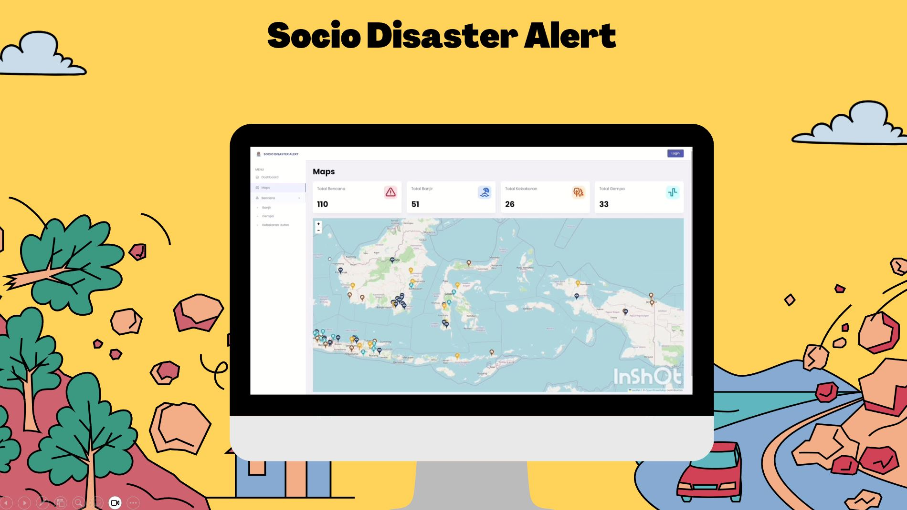

# Socio Disaster Alert
Socio Disaster Alert adalah aplikasi web untuk memantau bencana alam berdasarkan postingan status-status dari media sosial Twitter/X. Alur aplikasi web ini dapat dilihat pada gambar di bawah ini.

Dari alur cara kerja dapat dilihat ada modul Pengambilan Data dari media sosial. Untuk pengambilan data dapat dilakukan dengan mengakses halaman dari menu Data Master > Tweet.
 
Data diambil berdasarkan kata kunci yang telah ditentukan. Untuk penentuan kata kunci dapat dilakukan dengan mendaftarkan dari halaman Setup > Kata Kunci.
 
Setelah data tweet dikumpulkan selanjutnya dilakukan klasifikasi teks dengan kecerdasan buatan, tujuannya untuk menentukan mana kalimat yang bermakna bencana dan mana yang bukan. Karena ada kalimat yang berisi kata kunci "banjir" atau "kebakaran" tapi makanya bukan tentang bencana, seperti:
1. hari ini banyak banjir diskon.
2. dia marah-marah seperti orang kebakaran jenggot
Proses klasifikasi teks oleh kecerdasan buatan dilakukan pada aplikasi ini.

Selanjutnya aplikasi ini digunakan untuk melihat rekap kejadian bencana dengan melihat Dashboard. Dan juga dapat digunakan untuk melihat lokasi dan waktu kejadian bencana dari peta.

